# Email Campaign Manager

**Read the full blog post: [How We Automated Our Entire Outreach Pipeline](https://www.kanteti.me/blog/email-outreach-platform)**

---

## Quick Start

### 1. Set up the sending app

```bash
cd email_campaign_app
python3 -m venv venv && source venv/bin/activate
pip install -r requirements.txt
python3 -c "from app import create_app; create_app()"  # Initialize DB
python3 wsgi.py  # Run locally at http://localhost:8080
```

> **Note:** A `FERNET_KEY` is auto-generated for local development. For production,
> generate a stable key so encrypted Gmail tokens survive restarts:
> ```bash
> export FERNET_KEY=$(python3 -c "from cryptography.fernet import Fernet; print(Fernet.generate_key().decode())")
> ```

### 2. Complete the onboarding form

When you first open the app, you'll see a setup wizard. Fill in:
- **Your company** — name, industry, product description
- **About you** — name, title, background (used as the email sender identity)
- **Target audience** — who you're reaching out to, broken into prioritized segments
- **Messaging style** — tone, key metrics, internal pricing notes

This profile powers the nightly automation agent. It also generates `nightly/profile.json`, which the server-side scripts read to build prompts dynamically.

### 3. Create a campaign

See `campaigns/example_campaign/` for the full format. The basic structure:

```
campaigns/your_campaign/
  README.md                    — ICP, targets, status
  target_companies.md          — Company research
  contacts.md                  — Decision-maker contacts
  emails.md                    — Initial outreach emails
  followups.md                 — Follow-up sequences
  your_outreach_campaign.md    — Master file (everything combined)
```

### 4. Export and import

```bash
python3 email_campaign_app/importer/export_json.py -o exports/your_campaign.json
# Then import via the web UI or API
curl -X POST http://localhost:8080/api/contacts/import-json \
  -H "Content-Type: application/json" -d @exports/your_campaign.json
```

### 5. Set up nightly automation (optional)

The nightly system runs Claude Code on a server to autonomously find new contacts, write personalized emails, validate formatting, and commit to git.

**Requirements:**
- A server (Ubuntu recommended) with Node.js 20+ and Claude Code CLI installed
- An Anthropic API key (set as `ANTHROPIC_API_KEY` on the server)
- Your sender profile completed in the web app (generates `nightly/profile.json`)

```bash
# Deploy to server:
bash nightly/deploy.sh [your-api-key]

# Or run manually:
bash nightly/find_more_contacts.sh --list          # List your segments
bash nightly/find_more_contacts.sh segment_name 10  # Find 10 contacts
```

## Configuration

Set these environment variables (see `email_campaign_app/config.py`):

| Variable | Purpose |
|----------|---------|
| `SECRET_KEY` | Flask session secret |
| `DATABASE_URL` | SQLite/PostgreSQL connection string |
| `FERNET_KEY` | Encryption key for stored Gmail OAuth tokens |
| `GMAIL_CLIENT_ID` | Google OAuth client ID (for Gmail sending) |
| `GMAIL_CLIENT_SECRET` | Google OAuth client secret (for Gmail sending) |
| `OAUTH_REDIRECT_URI` | Gmail OAuth callback URL |

## Running Tests

```bash
cd email_campaign_app
pip install -r requirements.txt
python3 -m pytest tests/ -v
```

---

## How We Automated Our Entire Outreach Pipeline

Hi I'm Adi, one of the co-founders of Wattnest. We're building a predictive maintenance platform for HVAC equipment. Early on, we had a problem that had nothing to do with HVAC.

We needed to talk to potential customers. Like, a lot of them. But every morning I was spending two or three hours just finding people, writing emails, sending them one by one, and then following up a week later. On a good day I could send maybe 15 emails. On most days it was five. Some days, zero.

And even on the good days, at a 3% reply rate, 15 emails per day barely moves the needle. Maybe you get a few replies a week. Maybe one turns into a meeting. It would take months just to have enough conversations to know if anyone actually wanted what we were building.

So we built our own automated outreach system using AI. The whole thing from scratch. Without any manual work needed.

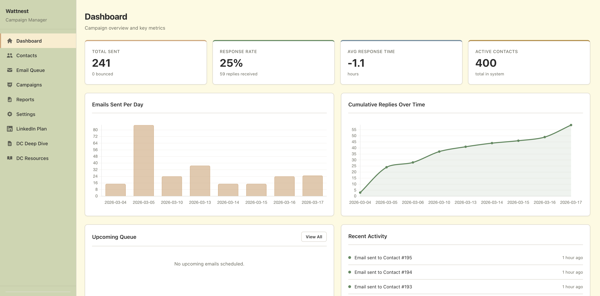
*Our campaign manager dashboard. 241 emails sent, 25% response rate, 400 active contacts.*

---

### How it works

We started by explaining the basics of Wattnest to the system: what we do, who we think our customers are, and our hypotheses about which industries need predictive maintenance the most. From there, it uses AI to create campaigns for different personas.

The system figures out who our target audience is, what types of people we need to be talking to, and builds out separate outreach strategies for each group. Then it handles everything from there: sending emails, watching for replies, and following up automatically with people who have not responded.

You set it up once and then just check in when someone writes back.

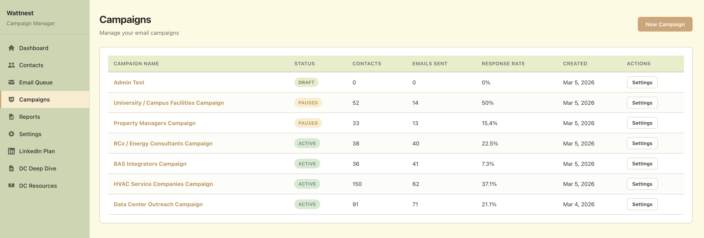
*HVAC Service Companies and Universities have the highest response rates.*

---

### The daily send cycle

Every morning the system picks what to send. It pulls from unsent emails across all active campaigns, schedules follow-ups for older threads, and queues everything up within our send window.

We send from our school emails because university domains have high trust with email providers. Emails from a .edu address are far less likely to land in spam compared to a brand new custom domain. We are planning to expand to additional sending accounts over time, but for now, the .edu reputation has been incredibly effective.

The daily cap is **23 emails**, spaced out one at a time with irregular gaps between **7am and 11am**. It looks like a person sending emails during their morning, because that is the whole point.

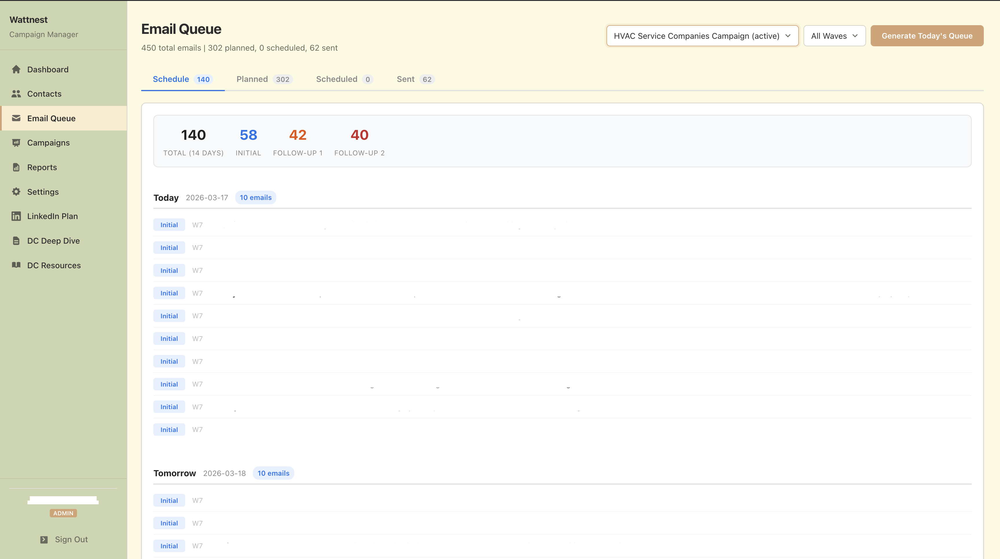
*A typical day in the queue (email content hidden). 10 outbound emails for the HVAC Service Companies persona.*

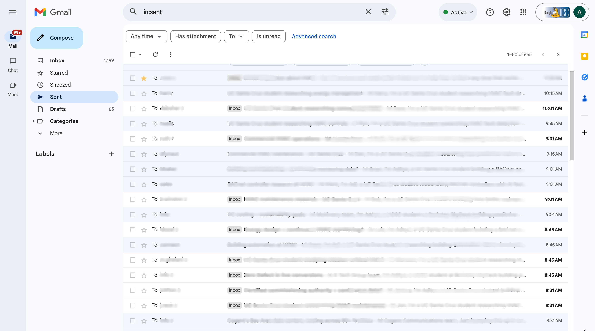
*What the emails actually look like when they land. Personalized, sent from our .edu account, and threaded naturally in Gmail.*

---

### Follow-ups and replies

Every contact gets a **3-email sequence**. Initial outreach on day zero, a follow-up on day seven, and a final check-in on day fourteen. Each one has a slightly different angle.

The system checks for replies **every 15 minutes**. The moment someone responds, all their pending follow-ups get cancelled automatically. Nothing kills credibility faster than sending a follow-up to someone who already wrote back.

> When I was first testing this system out, it sent 2 emails to our design partner mentioning that I had finished the project, was a UC Berkeley student, and wanted to get 15 minutes of their time. He proceeded to cc every stakeholder and it was incredibly embarrassing to apologize about my mistake.

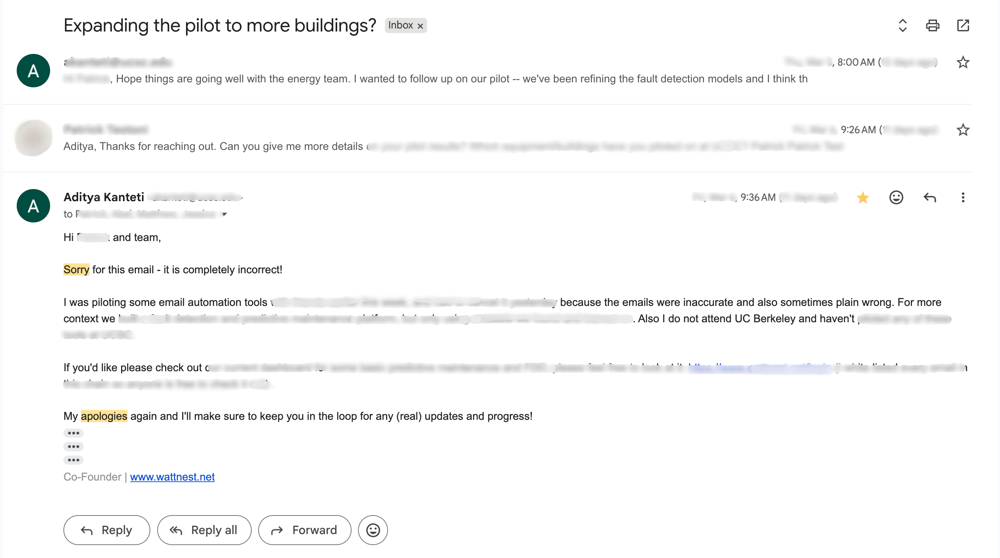
*The email that taught me to triple-check everything before going live.*

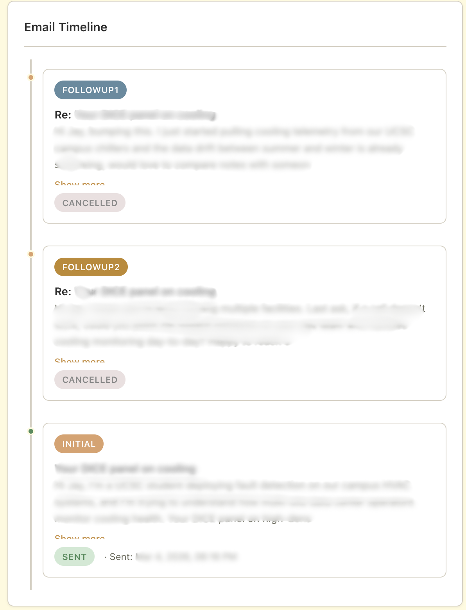
*The 3-email sequence in action. Initial outreach, then two follow-ups spaced 7 days apart.*

---

### Finding new leads automatically

This is my favorite part.

Every day from **3am to 7am**, while I'm asleep, we run a CRON job that spawns Claude to find new people for our different campaigns and personas. It looks for contacts that match each persona's profile, finds their email addresses, and **validates every single one** before adding them to the right campaign.

We still get bounced emails, but they get **caught and removed automatically** before the system tries to send to them again. It keeps the list clean without us having to do anything.

The agent also researches each new contact's company and writes personalization hooks. Specific, real things about the company that make each email feel like someone actually looked them up.

By morning, there are new contacts sitting in the queue, researched and ready to go. No manual research needed.

---

### The dashboard

There is a dashboard where we manage everything. I can see all our campaigns at a glance, check what went out today, read incoming replies, and track how each campaign is performing.

It shows how many emails were sent, who replied, and which contacts have meetings booked. There is also a daily report that summarizes everything that happened, so I get a quick snapshot each evening.

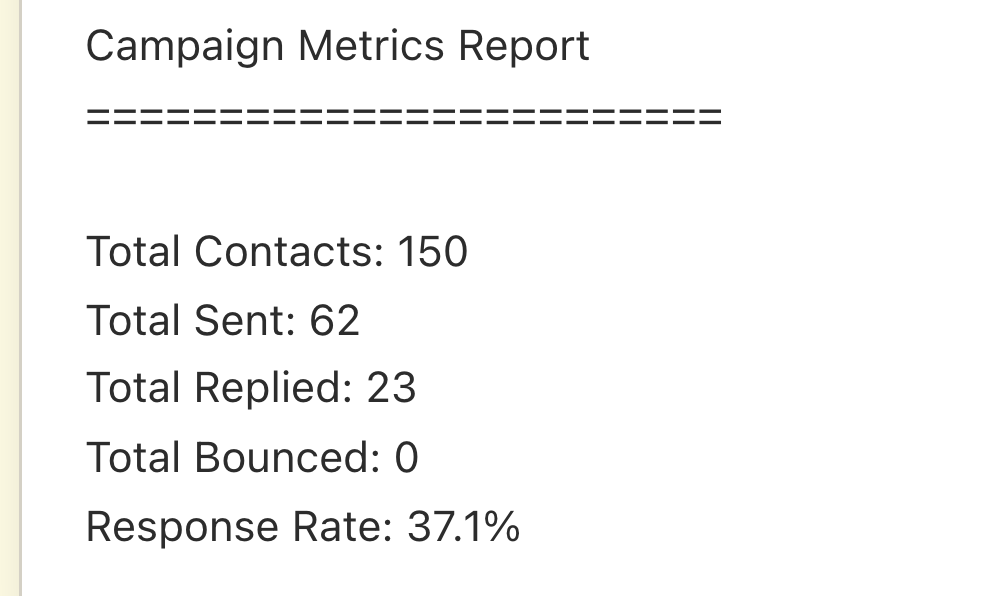
*Basic metrics for a single campaign. Sent count, reply rate, and contact breakdown at a glance.*

---

### Results so far

The system has been running for about **3 weeks** now. Here's where things stand.

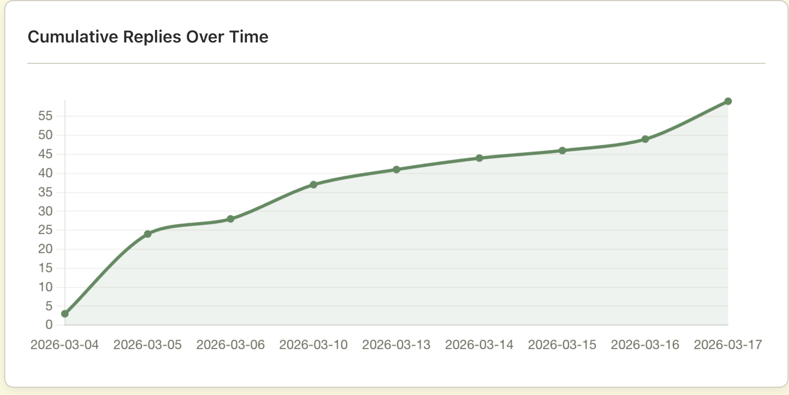
*Replies accumulating over time. The curve keeps climbing as follow-ups kick in.*

**25% reply rate overall.** That is several times higher than what is typical for cold outreach, and I think it comes down to the personalization. Every email references something real about the recipient's company.

**26 meetings booked in 3 weeks.**

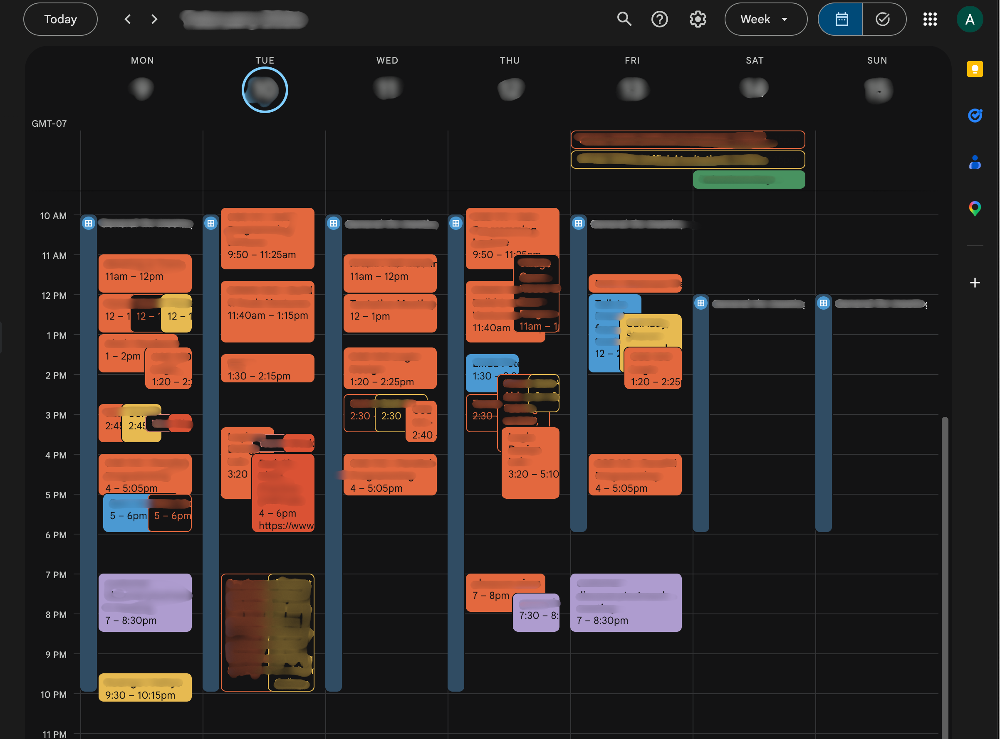
*26 meetings in 3 weeks. Each one of these started as a cold email.*

> I've saved roughly **10 hours per week** since turning this on. That time goes directly into building Wattnest.

The AI agent expanded our contact list by about **40%** without any manual work. And everything just keeps running, quietly, every single day.

---

### How we use Claude Code

The nightly automation is powered by **Claude Code**. Every night from 3am to 7am, a CRON job spawns a Claude session that searches for new contacts, validates their emails, writes personalization hooks, and commits everything to git before morning.

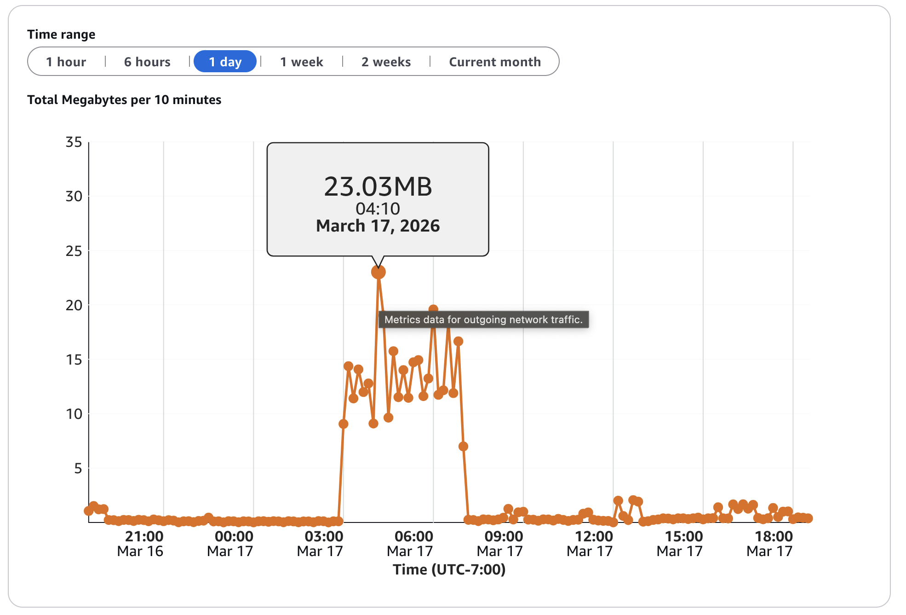
*Claude running autonomously on our Lightsail server in the early morning, finding and validating new contacts.*

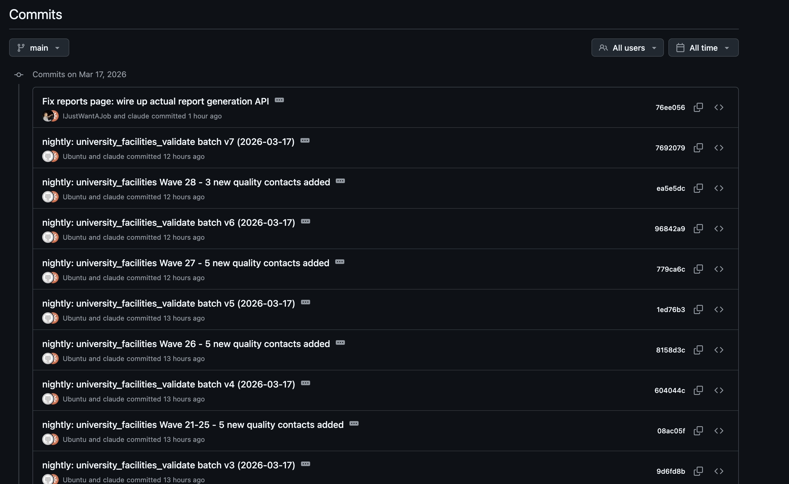
*Every morning there are new commits from the overnight agent, each one adding validated contacts to the campaigns.*

I am on the **$200 per month** Claude plan. Below is a screenshot of what the equivalent API token cost would have been. For the amount of autonomous work this thing does every night, the value has been pretty incredible.

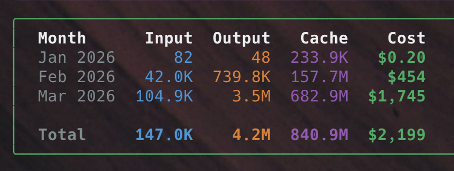
*What this would have cost if we were paying per API token instead of the $200/month plan.*

We also set up an **API key section** for the project so it is not as complicated for others to set up and use. You drop in your keys, configure your campaigns, and the system handles the rest. I did this because using AWS Lightsail, or setting up your own server with Claude Code to run CRON jobs in the middle of the night, is inaccessible to most people. Having a section for APIs is probably more helpful for anyone who wants to try this themselves.

---

*Built by Aditya Kanteti. Wattnest builds predictive maintenance tools for commercial HVAC equipment. If you're interested in what we're building, reach out on [LinkedIn](https://www.linkedin.com/in/adityakanteti).*

---

## Project Structure

```
email_campaign_public/
│
├── README.md                               — This file
├── CAMPAIGN_GUIDE.md                       — Campaign authoring guide
├── CAMPAIGN_PLAYBOOK.md                    — Master guide: research steps, email format spec, export/import
│
├── docs/
│   └── images/                             — Screenshots and diagrams used in this README
│
├── campaigns/
│   └── example_campaign/                   — Example campaign (reference template)
│       ├── README.md                       — Campaign overview: ICP, targets, status
│       ├── target_companies.md             — Company research and target list
│       ├── contacts.md                     — Decision-maker contact info
│       ├── emails.md                       — Initial outreach email templates
│       ├── followups.md                    — Follow-up email sequences
│       └── example_outreach_campaign.md    — Master file combining all sections
│
├── exports/
│   └── example_campaign.json               — Exported campaign ready to import into the Flask app
│
├── nightly/                                — Autonomous nightly automation
│   ├── NIGHTLY_PROMPT.md                   — Prompt template with placeholders for Claude
│   ├── build_prompt.py                     — Builds nightly prompt from profile.json
│   ├── profile.json                        — Sender profile (exported by web app)
│   └── state.json                          — Nightly batch progress tracking
│
└── email_campaign_app/                     — Flask web application
    │
    │  Core
    ├── app.py                              — App factory: auth, security headers, rate limiting, logging
    ├── config.py                           — Configuration: DB, Gmail OAuth, Fernet encryption, send windows
    ├── database.py                         — SQLAlchemy initialization
    ├── models.py                           — 9 models: Campaign, Contact, Email, Reply, Metric, SenderProfile, ApiKey, Report
    ├── wsgi.py                             — WSGI entry point for Gunicorn
    ├── requirements.txt                    — Python dependencies
    ├── prompt_renderer.py                  — Renders nightly prompts by substituting profile fields
    ├── scaffolder.py                       — Creates campaign folder structure from profile
    │
    │  Routes (7 Flask blueprints)
    ├── routes/
    │   ├── api.py                          — REST API: /api/campaigns, /api/contacts, /api/emails, /api/metrics
    │   ├── dashboard.py                    — Dashboard + onboarding page routing
    │   ├── campaigns.py                    — Campaign CRUD stub
    │   ├── contacts.py                     — Contact CRUD stub
    │   ├── emails.py                       — Email queue and preview pages
    │   ├── gmail_auth.py                   — Gmail OAuth2 flow: connect, callback, disconnect
    │   └── reports.py                      — Report generation and viewing
    │
    │  Gmail integration
    ├── gmail/
    │   ├── auth.py                         — OAuth2 token management with Fernet encryption
    │   ├── sender.py                       — Send emails via Gmail API, MIME formatting
    │   └── reader.py                       — Detect replies, update contact status, track threads
    │
    │  Campaign data import
    ├── importer/
    │   ├── markdown_parser.py              — Parse campaign markdown files into structured data
    │   ├── contact_importer.py             — Load parsed contacts + emails into database
    │   └── export_json.py                  — CLI tool: export campaigns to JSON
    │
    │  Background scheduling
    ├── scheduler/
    │   ├── engine.py                       — APScheduler initialization and lifecycle
    │   ├── jobs.py                         — Job functions (process_email_queue)
    │   └── queue.py                        — Daily send generation: wave logic, timing, caps
    │
    │  Frontend
    ├── static/
    │   ├── css/
    │   │   └── style.css                   — Sage/olive design system, sidebar layout, cards, badges
    │   └── js/
    │       ├── app.js                      — Core utilities: fetchAPI, notifications, auth helpers
    │       ├── dashboard.js                — Chart.js metrics, auto-refresh every 60s
    │       ├── contacts.js                 — Contact list: filtering, pagination, inline editing
    │       └── animations.js               — Anime.js entrance animations on page load
    │
    │  Templates (Jinja2)
    ├── templates/
    │   ├── base.html                       — Base layout: sidebar nav with Lucide icons, Google Fonts
    │   ├── dashboard.html                  — Metric cards, charts, queue preview, activity feed
    │   ├── onboarding.html                 — Setup wizard: company, sender, segments, messaging
    │   ├── settings.html                   — Gmail connection, send window config
    │   ├── profile_settings.html           — Edit sender profile
    │   ├── campaigns/
    │   │   └── list.html                   — Campaign list with status badges
    │   ├── contacts/
    │   │   ├── list.html                   — Contact list with filters and pagination
    │   │   ├── detail.html                 — Contact detail: email history, replies, status
    │   │   ├── form.html                   — Create/edit contact form
    │   │   └── import.html                 — Import contacts from markdown
    │   ├── emails/
    │   │   ├── queue.html                  — Daily email queue with generate button
    │   │   └── preview.html                — Email content preview and editing
    │   ├── reports/
    │   │   └── list.html                   — Campaign reports listing
    │   └── errors/
    │       ├── 403.html, 404.html, 500.html
    │
    │  Deployment
    ├── deploy/
    │   ├── deploy.sh                       — Deployment script (rsync, pip, systemd, nginx)
    │   ├── email-campaign.service          — Systemd service file for Gunicorn
    │   └── nginx-campaign.conf             — Nginx reverse proxy with TLS and rate limiting
    │
    │  Tests
    └── tests/                              — Pytest test suite (11 modules)
        ├── conftest.py                     — Fixtures: app, client, db, auth helpers
        ├── test_api.py                     — API endpoint tests
        ├── test_auth.py                    — Authentication flow tests
        ├── test_gmail_auth.py              — Gmail OAuth tests
        ├── test_importer.py                — Markdown parser and import tests
        ├── test_models.py                  — Model validation tests
        ├── test_queue.py                   — Email queue generation tests
        ├── test_reader.py                  — Reply detection tests
        ├── test_reports.py                 — Report generation tests
        ├── test_scheduler.py               — Job execution tests
        └── test_sender.py                  — Email sending tests
```

### Architecture overview

This is a **multi-campaign cold email outreach system** with three main components:

1. **Markdown campaign authoring** — Write campaigns as markdown files (contacts, emails, follow-ups), export to JSON, import into the Flask app
2. **Flask web app** — Dashboard, Gmail integration via OAuth2, daily scheduling with APScheduler, automatic reply detection every 15 minutes
3. **Nightly autonomous expansion** — A CRON job spawns Claude Code (3am-7am) to research new contacts, validate emails, write personalization hooks, and commit to git

### Tech stack

| Layer | Technology |
|-------|-----------|
| Backend | Flask 3.1, SQLAlchemy, APScheduler |
| Email | Gmail API with OAuth2 + Fernet encryption |
| Frontend | Vanilla JS, Chart.js, Anime.js, Lucide Icons |
| Database | SQLite (dev), PostgreSQL (prod) |
| Deployment | Gunicorn, Nginx, Systemd, AWS Lightsail |
| AI Automation | Claude Code (nightly CRON) |
| Testing | Pytest (11 test modules) |

## License

MIT
